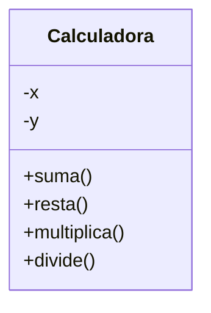

# Ejercicio - Calculadora aritmética Simple

## Descripción del Problema

Este ejercicio implementa una calculadora aritmética simple (suma, resta, multiplica, divide).

## Ejecución

Tu programa debería ejecutarse de la siguiente manera:

```
Calculadora aritmetica
======================
Introduce el primer operando:12
Introduce el segundo operando:4
12+4=16
12-4=8
12*4=48
12/4=3
```

## Diagrama de Clases

Construye aquí el Diagrama de Clases de tu solución, usando el [Lenguaje Mermaid](https://mermaid.js.org/syntax/classDiagram.html).


Puedes apoyarte con el editor [Mermaid-live](https://mermaid.live/).

## Objetivo

- Busca que el código pase correctamente todas las pruebas
   * Solamente cambia los archivos permitidos para lograr este objetivo (abajo se indican las reglas específicas)
   
- Las GitHub Actions deberán presentar una palomita en verde si se han satisfecho todas las pruebas, y una cruz roja cuando alguna (o todas) las pruebas han fallado.
   * **Recomendación:** Puedes dar clic en la cruz roja para verificar cual de las pruebas ha fallado (o si el código no ha compilado correctamente).
   * **Recomendación:** En caso de que el Autograding no muestre pruebas o no funcione, contacta a tu profesor mediante un issue.

## Instrucciones

- Deberás modificar los archivos (`.cpp` y `.hpp`) que consideres conveniente.

Explicación de los otros archivos:

- Archivo `test/tests.cpp` tiene las pruebas de esta actividad (NO LO CAMBIES!)
- Archivo `test/catch.hpp` tiene la biblioteca de pruebas  CATCH2 (NO LA CAMBIES!)
- Archivo `makefile` tienes los comandos para ejecutar la actividad (NO LO CAMBIES!)
- Archivo  `./build/appTests` se generará después de compilar (para **pruebas locales**, solo ejecútalo)

## Comandos para pruebas locales, ejecución y depuración

- Comando para construir y ejecutar pruebas: `make` o `make test`
    * Si el ejecutable ya está construido, sólo teclea : `./build/appTests`

- Comando para construir y ejecutar la aplicación: `make run` 
    * Si el ejecutable ya está construido, sólo teclea : `./build/exercise`

- Comando para depurar con línea de comandos: `make debug`
    * Para conocer los comandos de depuración consulta:
     https://u.osu.edu/cstutorials/2018/09/28/how-to-debug-c-program-using-gdb-in-6-simple-steps/

- Comando para depurar la ejecución del programa con `vsCode` o en `GitPod`: `make debugvs` 
    * Utilizar el depurador de la IDE.

- Comando para depurar la ejecución de las pruebas con `vsCode` o en `GitPod`: `make debugtest` 
    * Utilizar el depurador de la IDE.

## Notas

- El código será evaluado solamente si compila.
   * La razón de esto es, si no compila no es posible generar el ejecutable y realizar las pruebas.

- Algunos casos de prueba podrían recibir calificación individual, otros podrían recibir calificación y si pasan todos juntos (o todas las pruebas en conjunto).

- La calificación final se otorgará de manera automática en cada *commit*, y se evaluará solamente hasta la fecha limite de la actividad.

Para dudas adicionales, consulta a tu profesor.

## License

MIT License 2020
